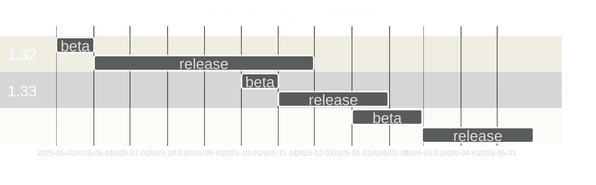

KubeZero - Zero Down Time Kubernetes platform
========================
KubeZero is a Kubernetes distribution providing an integrated container platform so you can focus on your applications.

# Design philosophy

- Focus on security and simplicity over feature creep
- No vendor lock in, most components are optional and could be easily changed as needed
- No premium services / subscriptions required
- Staying up to date and contributing back to upstream projects, like alpine-cloud-images and others
- Cloud provider agnostic, bare-metal/self-hosted
- Organic Open Source / open and permissive licenses over closed-source solutions
- Corgi approved :dog:

# Architecture

# Version / Support Matrix
KubeZero releases track the same *minor* version of Kubernetes.
Any 1.32.X-Y release of Kubezero supports any Kubernetes cluster 1.32.X.

KubeZero is distributed as a collection of versioned Helm charts, allowing custom upgrade schedules and module versions as needed.

[Upstream release policy](https://kubernetes.io/releases/)

# Components

## OS
- all compute nodes are running on Alpine V3.22
- 2 GB encrypted root file system
- no external dependencies at boot time, apart from container registries
- focused on security and minimal footprint

## GitOps
- cli / cmd line install
- optional full ArgoCD support and integration

## Featured workloads
- rootless CI/CD build platform to build containers as part of a CI pipeline, using podman / fuse device plugin support
- containerized AI models via integrated out of the box support for Nvidia GPU workers as well as AWS Neuron

## Control plane
- all Kubernetes components compiled against Alpine OS using `buildmode=pie`
- support for single node control plane for small clusters / test environments to reduce costs
- access to control plane from within the VPC only by default ( VPN access required for Admin tasks )
- controller nodes are used for various platform admin controllers / operators to reduce costs and noise on worker nodes

## AWS integrations
- IAM roles for service accounts allowing each pod to assume individual IAM roles
- access to meta-data services is blocked all workload containers on all nodes
- all IAM roles are maintained via CloudBender automation
- aws-node-termination handler integrated
- support for spot instances per worker group incl. early draining etc.
- support for [Inf1 instances](https://aws.amazon.com/ec2/instance-types/inf1/) part of [AWS Neuron](https://aws.amazon.com/machine-learning/neuron/).

## Network
- Cilium using Geneve encapsulation, incl. increased MTU allowing flexible / more containers per worker node compared to eg. AWS VPC CNI
- no restrictions on IP space / sizing from the underlying VPC architecture
- Multus support for multiple network interfaces (NoCloud only)

## Storage
- flexible EBS support incl. zone awareness
- EFS support via automated EFS provisioning for worker groups via CloudBender automation
- local storage provider (OpenEBS LVM) for latency sensitive high performance workloads
- CSI Snapshot controller and Gemini snapshot groups and retention

## Ingress
- AWS Network Loadbalancer and Istio Ingress controllers
- no additional costs per exposed service
- real client source IP available to workloads via HTTP header and access logs
- ACME SSL Certificate handling via cert-manager incl. renewal etc.
- support for TCP services
- optional rate limiting support
- optional full service mesh

## Metrics
- Prometheus support for all components, incl. out of cluster EC2 instances (node_exporter)
- automated service discovery allowing instant access to common workload metrics
- pre-configured Grafana dashboards and alerts
- Alertmanager events via SNSAlertHub to Slack, Google, Matrix, etc.

## Logging
- all container logs are enhanced with Kubernetes and AWS metadata to provide context for each message
- flexible ElasticSearch setup, leveraging the ECK operator, for easy maintenance & minimal admin knowledge required, incl. automated backups to S3
- Kibana allowing easy search and dashboards for all logs, incl. pre configured index templates and index management
- [fluentd-concerter](https://git.zero-downtime.net/ZeroDownTime/container-park/src/branch/master/fluentd-concenter) service providing queuing during highload as well as additional parsing options
- lightweight fluent-bit agents on each node requiring minimal resources forwarding logs secure via TLS to fluentd-concenter
